# Stock Price Prediction and Recommendation Application

## Overview
The stock market is full of uncertainties, expectations, and environmental influences. Many investors, especially new ones, struggle with decision-making due to greed, fear, and misinformation. This leads to significant financial losses and discourages further investment.

This project focuses on **technical analysis** for stock price prediction and recommendation. The application provides **real-time stock data**, calculates **various indicators**, and implements **automated trading strategies**. Additionally, it incorporates **deep learning** to forecast stock prices and **sentiment analysis** on business news to account for economic, political, and natural disaster impacts.

### Key Features:
- **Real-time stock data processing** for Pakistan Stock Exchange (PSX) and American Gold Market.
- **Technical analysis** with daily, weekly, monthly, and six-month indicators.
- **Deep learning-based future stock price predictions.**
- **Sentiment analysis** on business news to enhance decision-making.
- **Portfolio generator** for customized investments.
- **Two recommendation systems:**
  1. **Analysis-based recommendation** (short-term, medium-term, long-term decisions).
  2. **Technical recommendation** (stocks with maximum buy signals from multiple strategies).

## Installation
To set up the project, follow these steps:

### Prerequisites:
- Python 3.8+
- Git
- Virtual Environment (optional but recommended)
- Dash Framework

### Clone the Repository:
```sh
git clone https://github.com/Zarar-Azwar/Stock_price_prediction.git
cd stock-prediction
```

### Create a Virtual Environment (Optional but Recommended):
```sh
python -m venv venv
source venv/bin/activate  # On Windows use: venv\Scripts\activate
```

### Install Dependencies:
```sh
pip install -r requirements.txt
```

## Running the Application
### 1. Data Collection
Scrapping Realtime Data from PSX website and From gold and oil data from yahoo finance. Example data download from
<a href="https://drive.google.com/drive/folders/1ySV4uOrhZTTut-e5n_L4VABABcHUv-1g?usp=sharing">

https://drive.google.com/drive/folders/1ySV4uOrhZTTut-e5n_L4VABABcHUv-1g?usp=sharing
</a>

### 2. AI Models
Download AI models from following google drive link

<a href="https://drive.google.com/drive/folders/1sYCiAPSTsZv7tk_yfHEzUTXcJcAVW4CK?usp=sharing">

https://drive.google.com/drive/folders/1sYCiAPSTsZv7tk_yfHEzUTXcJcAVW4CK?usp=sharing
</a>

### 4. Run the Web Application
Start the web-based interface to visualize predictions and recommendations:
```sh
python index.py
```

Then open **http://127.0.0.1:8050/** in your browser.

## AI Model Results
The following are sample results of our AI stock prediction models and recommendation systems:

### Stock Price Prediction (Deep Learning Model Output)
#### Few Examples
<p align="center">
  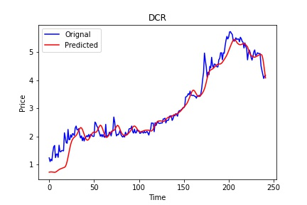
  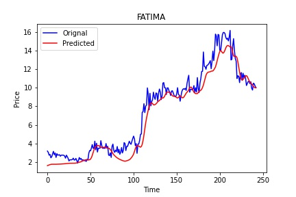
  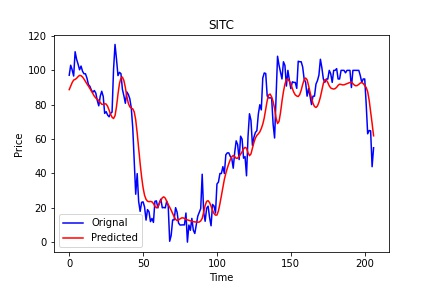
  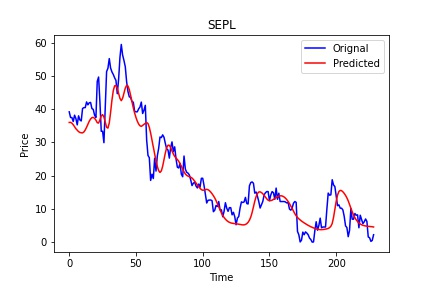
  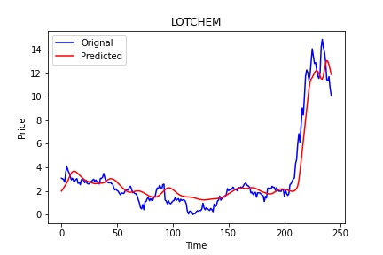
</p>
<p align="center">
  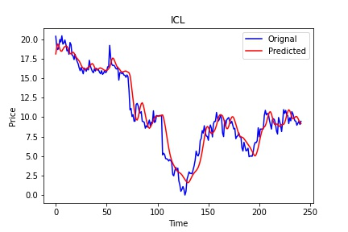
  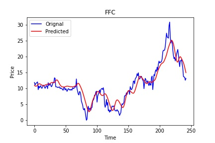
  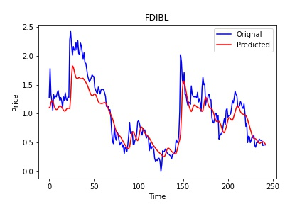
  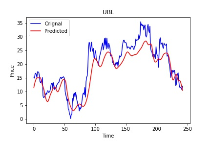
  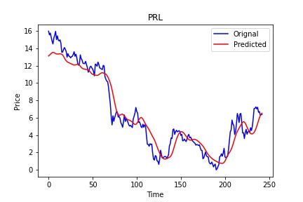
</p>

### Technical Recommendation System
#### Few Examples
<p align="center">
  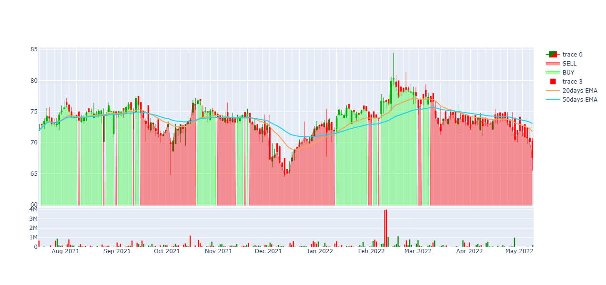
  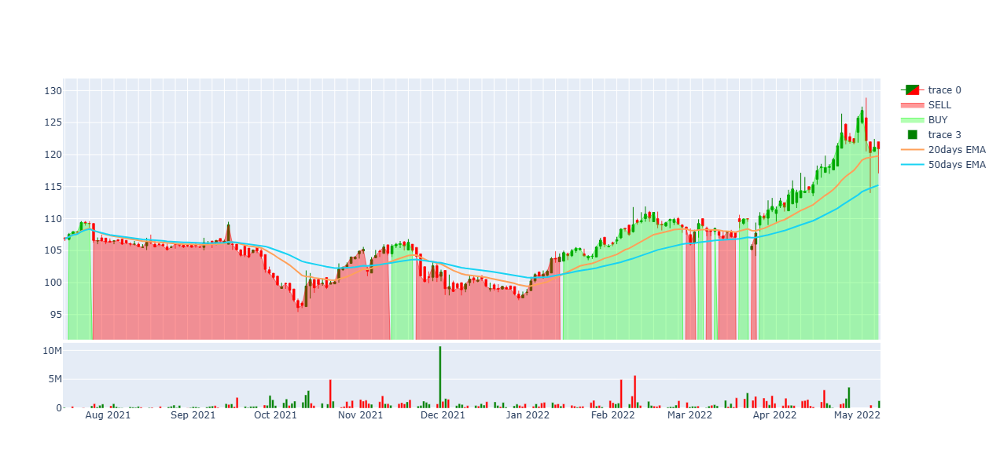
</p>

### Portfolio Generator
#### Few Examples
<p align="center">
  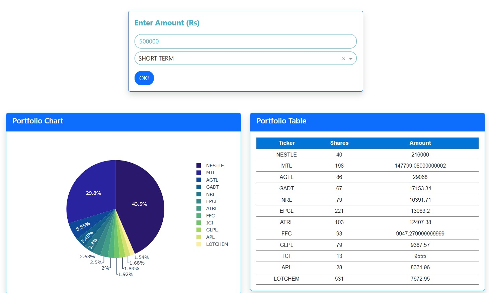
  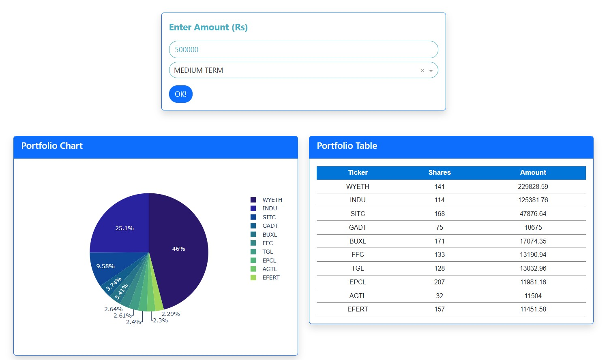
  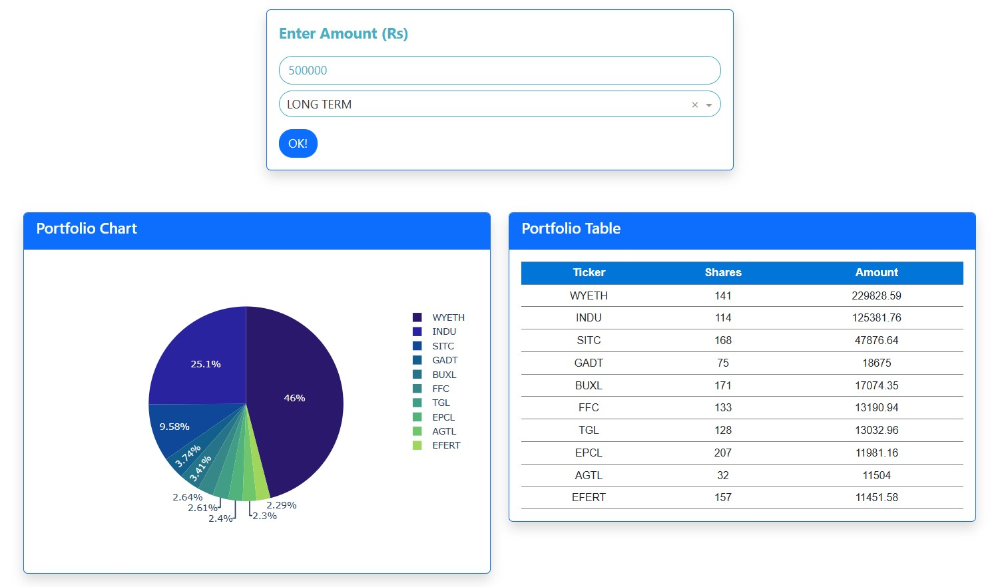
</p>
### Sector Analysis
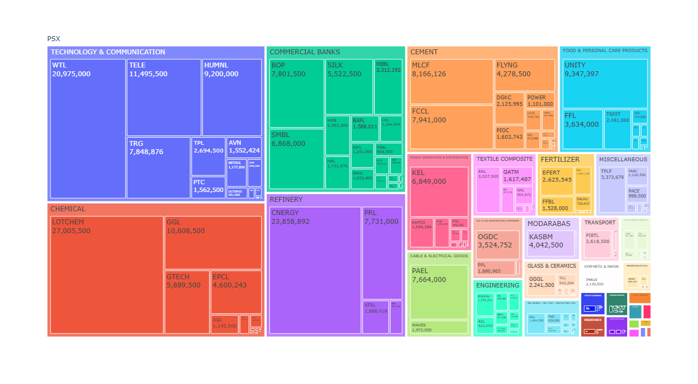

## Contribution
We welcome contributions to improve this project! To contribute:
1. Fork the repository.
2. Create a new branch (`feature-branch`).
3. Commit your changes.
4. Push to your branch and create a pull request.


